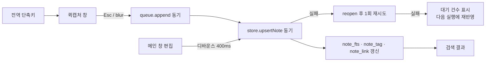

# WHENNOTE — 기술 스펙과 결정 기록

> 원칙은 하나다: **WHENWORK가 검증한 것은 그대로 쓰고, 메모라서 다른 것만 새로 결정한다.** 요구사항 ID는 [02_요구사항.md](02_요구사항.md). WHENWORK 측 근거는 `../../whenwork/docs/06_내장저장소_전환_결정.md`와 `.claude/CLAUDE.md`. 2026-09-16 v0.1.

## 1. 스택 (WHENWORK와 동일)

| 항목 | 값 | 출처 |
|---|---|---|
| 런타임 | Electron 43.x (Node 24 내장), ES modules | WHENWORK package.json |
| UI | Vanilla HTML/CSS/JS, 프레임워크 없음 | WHENWORK 제약 "이미 돌아가는 UI를 다시 쓰지 않는다" |
| 저장소 | `node:sqlite` DatabaseSync, 단일 파일 `store.sqlite`, WAL + synchronous=FULL | WHENWORK D-14·D-17 |
| 캡처 큐 | append-only JSONL `queue.jsonl`, 시작 시 1회 재반영 | WHENWORK D-01·D-02 |
| 설정 | `settings.json`, 디바운스 쓰기 | WHENWORK settings.mjs |
| 글꼴 | Pretendard Variable 번들(OFL), CSP `default-src 'self'` | WHENWORK tokens.css |
| 테스트 | `node --test`, `electron . --smoke`, 강제 종료 스모크 | WHENWORK test/ |
| 빌드 | electron-builder 26.x, Windows NSIS x64, macOS dmg·zip arm64/x64 | WHENWORK build 설정 |
| 배포 | GitHub Releases 드래프트, 미서명, `CSC_IDENTITY_AUTO_DISCOVERY=false` | WHENWORK release.yml |
| 업데이트 | electron-updater 6.x, Windows 종료 시 설치, macOS 안내만 | WHENWORK update.mjs |
| 언어 | 한국어 UI 하나 | WHENWORK 제약 |

잠긴 버전(2026-09-16 `npm install`): Electron 43.7.1, electron-builder 26.x, electron-updater 6.x. 갱신은 `package-lock.json`이 원본이다.

검증 (2026-09-16, 이 PC): Electron 43.3.0 / Node 24.18.1 / SQLite 3.53.1에서 FTS5와 `trigram` 토크나이저, JSON 함수가 모두 동작한다. Node 24.13.0 단독도 동일. 검색 설계(§5)는 이 확인에 근거한다. FTS5 external-content 트리거(insert/delete/update)로 note 표와 색인이 동기화되는 것, trigram이 2글자 질의("회의")를 0건으로 내는 것도 같은 날 실측했다.

클립보드(Phase 3, CAP-07·MAIN-08): Electron 43.7.1에서 `clipboard.readText()`는 동기(문자열)이고 `readImage`·`availableFormats`가 있다. 다만 Electron 문서 main 브랜치의 breaking-changes에 `readText`가 Promise를 돌려주고 `readImage`가 `clipboard.read()`+MIME로 바뀌는 계획이 적혀 있다 → [오픈이슈 #5](#오픈이슈).

### 식별자

| | WHENWORK | WHENNOTE |
|---|---|---|
| package name | `whenwork` | `whennote` |
| productName | `WHENWORK` | `WHENNOTE` |
| appId | `com.when630.whenwork` | `com.when630.whennote` |
| 데이터 폴더 (`app.setName`) | `whenwork` | `whennote` |
| 기본 단축키 | `Ctrl+Alt+Space` | `Ctrl+Alt+N` (오픈이슈 #1) |
| 저장소 파일 | `store.sqlite` | `store.sqlite` (폴더가 다르므로 이름은 같게. WHENWORK D-14 "파일명에 앱 이름 안 넣기" 승계) |
| 설치 파일명 | `WHENWORK-<ver>-<os>-<arch>` | `WHENNOTE-<ver>-<os>-<arch>` |

## 2. 모듈 구조

WHENWORK의 3분할(lifecycle / ipc / jobs)을 그대로 쓴다. 파일 단위로 "복사"와 "새로 씀"을 나눈다.

| 파일 | 출처 | 비고 |
|---|---|---|
| `main/index.mjs` | 복사 | `bootstrap()` 한 줄 |
| `main/lifecycle.mjs` | 복사 후 수정 | 창 두 개(메인·퀵캡처) 크기·동작이 다르다. 스모크 프로브는 새로 쓴다 |
| `main/ipc.mjs` | 새로 씀 | 채널 목록은 §6 |
| `main/jobs.mjs` | 복사 후 축소 | 남는 잡: 소프트 삭제 30일 정리, 업데이트 확인, 첨부 고아 정리. 브리핑 없음 |
| `main/queue.mjs` | 복사 | 그대로. 항목 형태만 메모용 |
| `main/store.mjs` | 새로 씀 | 마이그레이션 체계·백업·손상 처리·NewerSchemaError는 WHENWORK에서 함수 단위로 가져온다 |
| `main/search.mjs` | 새로 씀 | 초성 변환·FTS 질의 조립·태그 파싱. Electron 무의존 순수 모듈 |
| `main/links.mjs` | 새로 씀 | `[[제목]]`·`#태그` 추출, 링크 테이블 동기화. 순수 모듈 |
| `main/settings.mjs` | 복사 | 그대로 |
| `main/place.mjs` | 복사 | 그대로 |
| `main/platform/*` | 복사 후 수정 | 기본 단축키 상수만 다르다. 계약 테스트 함께 복사 |
| `main/update.mjs` | 복사 | 리포 이름만 |
| `main/preload.cjs` | 복사 | 그대로 |
| `renderer/tokens.css` | 복사 후 수정 | 팔레트는 유지, 메모 본문용 타이포 토큰 추가(§7) |
| `renderer/md.js` | 복사 후 수정 | 체크박스 렌더링 제거, `[[링크]]` 렌더링 추가 |
| `renderer/icons.js` | 복사 후 추가 | |
| `renderer/capture.html/.js` | 새로 씀 | 다중 행, 항상-위, 클립보드 제안 |
| `renderer/main.html/.js` | 새로 씀 | WHENWORK `today.*`에 해당 |
| `renderer/view.js` | 새로 씀 | 결과 정렬·강조·그룹 순수 함수 |
| `tools/make-icon.mjs` | 복사 | 아이콘 원본만 교체 |
| `.github/workflows/release.yml` | 복사 | 리포 이름만 |

복사한 파일은 첫 커밋 메시지에 출처 커밋 해시를 남긴다. 이후 두 앱은 독립적으로 바뀐다.

## 3. 데이터 흐름



- 캡처 경로는 WHENWORK D-01·D-03과 같다. 퀵캡처 창은 실패를 보이지 않고 "저장됨"만 보인다.
- 메인 창의 편집 자동 저장은 큐를 거치지 않는다. 큐는 "앱이 죽어도 남아야 하는 첫 기록"을 위한 것이고, 편집 중인 메모는 이미 저장소에 있다. 대신 편집 중 강제 종료 대비로 렌더러가 마지막 본문을 `sessionStorage`가 아닌 IPC로 400ms마다 밀어 넣는다(디바운스가 곧 내구성 창).

## 4. 데이터 모델 (v1 스키마)

```sql
CREATE TABLE note (
  id          TEXT PRIMARY KEY,          -- UUID, 큐 항목과 같은 id (멱등 INSERT OR IGNORE)
  body        TEXT NOT NULL,             -- 원문 전체. 제목은 저장하지 않고 첫 줄에서 파생
  title       TEXT NOT NULL,             -- 파생 캐시: 첫 줄 trim, 없으면 작성 시각 문자열
  title_cho   TEXT NOT NULL,             -- 제목 초성 문자열 (SRCH-02)
  body_cho    TEXT NOT NULL,             -- 본문 초성 문자열
  created_at  TEXT NOT NULL,             -- ISO 8601 UTC (WHENWORK D-10)
  updated_at  TEXT NOT NULL,
  opened_at   TEXT NOT NULL,             -- 최근 열어본 순 정렬 키 (MAIN-02)
  pinned_at   TEXT,
  archived_at TEXT,
  deleted_at  TEXT                       -- 소프트 삭제, 30일 뒤 purge (MAIN-05)
);
CREATE VIRTUAL TABLE note_fts USING fts5(
  title, body, content='note', content_rowid='rowid', tokenize='trigram'
);
-- note INSERT/UPDATE/DELETE → note_fts 동기화 트리거 (FTS5 external content 표준 패턴)

CREATE TABLE note_tag (
  note_id TEXT NOT NULL, tag TEXT NOT NULL,
  PRIMARY KEY (note_id, tag)
);
CREATE INDEX note_tag_tag ON note_tag (tag);

CREATE TABLE note_link (
  from_id   TEXT NOT NULL,               -- 링크를 쓴 메모
  to_id     TEXT,                        -- 대상 메모. 없는 제목이면 NULL (LINK-02)
  to_title  TEXT NOT NULL,               -- 쓴 시점의 제목 텍스트
  PRIMARY KEY (from_id, to_title)
);
CREATE INDEX note_link_to ON note_link (to_id);

CREATE TABLE attachment (
  id TEXT PRIMARY KEY, note_id TEXT NOT NULL, file TEXT NOT NULL, created_at TEXT NOT NULL
);

CREATE TABLE event (                     -- KPI 로그 (WHENWORK 동일)
  id INTEGER PRIMARY KEY AUTOINCREMENT, at TEXT NOT NULL, kind TEXT NOT NULL, detail TEXT
);
```

- 태그와 링크는 **본문에서 파생**된다(LINK-01). `note_tag`·`note_link`는 검색·백링크용 인덱스이고, 저장할 때마다 `links.mjs`가 본문을 다시 파싱해 갈아끼운다. 원본은 항상 `body`다.
- `[[제목]]`은 저장 시점에 제목이 일치하는 메모의 `to_id`로 해석해 둔다. 대상 제목이 바뀌어도 `to_id`가 남아 링크가 깨지지 않는다(LINK-04). 본문 텍스트는 바꾸지 않는다. 렌더링은 `to_id`의 현재 제목을 보여 준다.
- 마이그레이션은 `PRAGMA user_version` 순번 배열, 배포 후 수정 금지, 이행 전 백업 5개 보관 (WHENWORK D-12·D-16 그대로).

## 5. 검색 설계

| 요구 | 방법 |
|---|---|
| 부분 문자열 (SRCH-01) | FTS5 `trigram` 토크나이저. 3글자 이상은 FTS5 MATCH, 1~2글자는 `LIKE '%q%'` 폴백 (trigram은 3자 미만을 못 찾는다) |
| 초성 (SRCH-02) | 검색어가 전부 초성 자모(`ㄱ-ㅎ`)이면 `title_cho`/`body_cho`에 `LIKE`. 혼합이면 일반 검색 |
| 태그 (SRCH-03) | 검색어에서 `#태그` 토큰을 떼어 `note_tag` 조인으로 AND 필터 |
| 정렬 (SRCH-05) | `pinned_at IS NOT NULL DESC, opened_at DESC`. 검색어가 있을 때도 같은 정렬(관련도 정렬은 하지 않는다. 사람은 최근 것을 찾는다) |
| 강조 (MAIN-02) | FTS5 `highlight()` 대신 렌더러에서 검색어 위치를 직접 찾아 감싼다. 초성 검색·LIKE 폴백과 방식이 하나가 된다 |
| 성능 (SRCH-04) | 1,000건 fixture로 `node --test` 계측. 50ms 초과 시 실패 |

초성 변환은 `search.mjs`의 순수 함수다. 완성형 한글 한 글자를 `(code - 0xAC00) / 588`로 초성 인덱스에 매핑한다. 한글이 아닌 글자는 그대로 둔다(영문·숫자도 초성열에 남아 "ㅎㅇ2026"식 혼합 질의가 된다).

## 6. IPC 채널

| 채널 | 방향 | 하는 일 |
|---|---|---|
| `capture:save` | R→M | `{id, body}`. 큐 append → store 반영. 항상 `{ok:true}` |
| `capture:clipboard` | R→M | 클립보드에 URL/텍스트가 있는지 미리보기 텍스트 반환 |
| `capture:pin` | R→M | 항상-위 토글 |
| `capture:openInMain` | R→M | 저장 후 메인 창에서 그 메모 열기 |
| `note:search` | R→M | `{q, tags}` → 결과 목록 |
| `note:get` | R→M | 본문·태그·백링크. `opened_at` 갱신 |
| `note:update` | R→M | 본문 자동 저장 |
| `note:create` | R→M | 검색어를 첫 줄로 새 메모 |
| `note:pin` `note:archive` `note:delete` `note:restore` | R→M | 상태 변경 |
| `note:attach` | R→M | 클립보드 이미지 → 파일 저장 → 링크 텍스트 반환 |
| `tag:list` | R→M | 태그와 건수 |
| `settings:get` `settings:set` | R→M | 단축키·자동 실행·창 위치 |
| `data:export` `data:exportMarkdown` `data:import` | R→M | DATA-01~03 |
| `update:check` | R→M | 수동 업데이트 확인 |
| `state:changed` | M→R | 저장소가 바뀌었으니 다시 그려라 (퀵캡처 저장 → 메인 창 갱신) |

## 7. 창과 화면

| | 메인 창 | 퀵캡처 창 |
|---|---|---|
| 크기 | 1120×720 기본, 최소 800×520, 크기 기억 | 380×320 기본, 세로만 조절, 위치 기억 |
| 모양 | 일반 프레임 (Win11 네이티브 라운드) | 프레임 없음, 투명 라운드, 드래그 영역 = 상단 바 (WHENWORK capture.html 방식) |
| 열기 | 트레이 클릭, 퀵캡처 `Ctrl+Enter`, 트레이 메뉴 | 전역 단축키 토글 |
| 닫기 | `Esc`(검색 비었을 때), 창 닫기 = 숨김 | `Esc` = 저장 후 닫기, blur = 항상-위 아닐 때만 닫기 |
| 폰트 | Pretendard, 본문 15px / 1.7 | Pretendard 16px |

디자인 토큰은 WHENWORK `tokens.css`의 다크 팔레트를 그대로 쓴다. 목업(`design/mockups/`)은 방향 탐색용이라 밝은 톤이었으나, 두 앱이 트레이에 나란히 살기에 **토큰을 공유하는 쪽**을 택한다. 목업은 구조만 참고하고 색은 tokens.css를 따른다. `--ai`·`--ai-dim` 토큰은 쓰지 않으므로 지운다.

## 8. 테스트·스모크·CI

- 순수 모듈(`search`·`links`·`queue`·`store`·`view`·`platform` 계약)은 `node --test`.
- `electron . --smoke`: 창을 띄우지 않고 메인 창 렌더러에서 검색→선택→편집→닫기 프로브를 돌린다. 프로브 문자열은 템플릿 리터럴 안에서 `${}`를 쓰지 않는다 (WHENWORK 주석의 함정 승계).
- `npm run smoke:crash`: `--inject-capture`로 메모를 넣고 SIGKILL → 재기동 → 검색 결과에 있는지. CAP-05의 증거.
- `electron . --smoke --shot=<폴더>`: 프로브 뒤에 메모를 하나 만들어 열고, 클립보드 이미지를 붙여 보고, 메인 창(편집·보기·설정)과 퀵캡처 창의 PNG를 폴더에 남긴다. 설정 패널 안에서 폭을 넘는 요소 목록(`settingsOverflow`)도 찍는다. 눈으로 보지 않고는 못 잡는 레이아웃 문제용.
- 새 테스트는 고친 코드를 되돌려 실패를 확인한다 (WHENWORK 제약 승계).
- CI는 `release.yml` 복사. ubuntu에서 xvfb로 test, windows·macos에서 smoke → build → 드래프트 릴리스.

## 9. 결정 기록

### D-01 저장소는 SQLite 단일 파일, 마크다운은 내보내기
- **결정**: 원본은 `store.sqlite`. 마크다운 폴더는 읽기 전용 내보내기(DATA-03).
- **왜**: WHENWORK가 같은 이유로 "사람이 편집하는 파일 원본"을 배제했다(동시 수정·손상을 앱이 감당). FTS5·트리거·백링크 인덱스가 파일 방식에서는 별도 인덱스 DB를 또 요구해 결국 두 원본이 된다.
- **폐기안**: 메모 하나 = `.md` 파일 하나를 원본으로(초기 아이디어). Dropbox 동기화가 공짜라는 장점이 있었다. 대신 DATA-03 마크다운 내보내기로 "데이터는 당신 것"을 지키고, v2 CONV-01(마크다운 폴더 가져오기)로 양방향 이동을 열어 둔다.
- **되돌리기 비용**: 높음. 스키마·검색·링크 전부가 SQLite를 전제한다.

### D-02 태그·링크는 본문 파생, 별도 편집 UI 없음
- **왜**: 페르소나가 정리에 시간을 쓰지 않는다. "태그 관리 화면"은 안 쓰인다. WHENWORK가 `#약어` 기능을 걷어낸 경험(`8336d4a`)과 반대로, 메모에서는 `#`가 곧 태그다. 단 `#201`처럼 숫자만 이어지면 태그로 보지 않아 이슈 번호 표기를 망치지 않는다.
- **폐기안**: 메모 메타데이터 패널에서 태그 편집. 화면과 저장 구조가 둘로 갈라진다.

### D-03 관련도 정렬 없음, 항상 최근 열어본 순
- **왜**: 사람은 최근 것을 다시 찾는다. 관련도는 검색어가 짧을 때 오히려 예측 불가다. 강조 표시가 "왜 이게 나왔나"를 대신 설명한다.
- **폐기안**: FTS5 `bm25()` 정렬. LIKE 폴백·초성 검색과 정렬 기준이 갈라져 결과가 검색어 길이에 따라 널뛴다.

### D-04 두 앱은 코드를 공유하지 않는다
- **왜**: 공용 패키지는 두 앱의 릴리스를 묶는다. 지금은 복사가 싸다.
- **재검토 시점**: 세 번째 앱, 또는 `queue`/`store` 마이그레이션 체계에 버그 수정이 두 번 이상 양쪽에 반영될 때.

### D-05 퀵캡처 창은 다중 행
- **왜**: WHENWORK는 한 줄(할 일 제목)이지만 메모는 여러 줄이 기본이다. 88px 한 줄 창을 재사용하지 않는다.
- **폐기안**: 한 줄로 시작해 Enter로 확장. 첫 Enter가 "저장"인지 "줄바꿈"인지 헷갈린다. 메모에서 Enter는 항상 줄바꿈이다.

### D-06 ~ D-09 (2026-09-16 오픈이슈 4건을 추천안으로 확정)
- **D-06 기본 단축키 `Ctrl+Alt+N`**: WHENWORK의 `Ctrl+Alt+` 체계와 같은 손 모양이고 충돌하지 않는다. macOS 조합은 platform 모듈이 WHENWORK와 같은 규칙으로 정한다. 폐기안 `Ctrl+Shift+Space`(목업 표기)·`Ctrl+Alt+M`.
  - **개정(2026-09-16)**: 단축키를 둘로 나눈다 — 퀵 메모 `Ctrl+Alt+M`, 메모 창 `Ctrl+Alt+N`(사용자 결정). 처음 고른 `Ctrl+N`은 다른 앱의 "새 파일·새 창"을 전역으로 가로채서 같은 날 물렸다. 설정에서 각각 바꿀 수 있다. 둘에 같은 조합을 주면 뒤에 등록하는 쪽이 실패해 화면에 드러난다(`lifecycle.applyHotkeys`).
- **D-07 메인 창 편집기는 `<textarea>` + 보기 토글**: WYSIWYG·분할 화면은 렌더러를 키운다. 폐기안 편집·보기 분할, 인라인 렌더.
- **D-08 첨부 이미지는 원본 저장, 10MB 초과 시 경고**: 사용자 파일을 손대지 않는다. 폐기안 자동 축소.
- **D-09 화면 색은 WHENWORK 다크 토큰**: 두 앱이 트레이에 나란히 산다. 목업의 밝은 톤은 구조 참고용으로만 남기고 캔버스는 다크로 갱신한다.

### D-10 순서 바꾸기는 고정한 메모끼리만 (2026-09-16)
- **결정**: `Shift+↑↓`는 고정 그룹 안에서만 자리를 바꾼다(`note.pin_order`, 스키마 v2). 고정 안 된 메모는 D-03의 최근 열어본 순 그대로다. 고정하면 그룹 맨 아래에 붙고, 해제하면 번호를 버린다.
- **왜**: 전체를 수동 정렬로 열면 "최근 것이 위에 온다"는 회수 규칙이 무너지고, 사용자가 정리에 시간을 쓰게 된다(페르소나 반대). 손으로 순서를 정할 가치가 있는 것은 사용자가 이미 골라 둔 고정 메모다.
- **폐기안**: 전체 수동 정렬(`sort` 컬럼). 사용자가 원하면 되돌릴 수 있는 결정이지만, 그때는 D-03을 함께 바꿔야 한다.
- **함께 정한 것**: 삭제 단축키는 `Ctrl+Delete`(본문 편집 중에는 비활성, 되돌리기 토스트), 키맵은 `Ctrl+/`(`?`는 검색창에서 글자 입력). 아카이브는 버튼만.

### D-11 첨부 이미지는 전용 스킴 `wn-attach://`로만 보여준다 (2026-09-16)
- **결정**: 이미지는 `userData/attachments/<UUID>.<ext>`에 저장하고 본문에는 ``을 넣는다. 렌더러는 `wn-attach://files/<이름>`으로 읽고, 메인 프로세스의 `protocol.handle`이 이름 규칙(UUID.확장자)에 맞고 폴더 안에 있는 파일만 낸다. CSP는 `img-src 'self' wn-attach:`.
- **왜**: 렌더러가 `file://`로 떠 있어 CSP `'self'`는 첨부 폴더를 가리키지 못하고, `img-src file:`을 열면 본문에 적은 아무 경로의 파일이 화면에 뜬다. Electron 보안 가이드도 file: 대신 커스텀 스킴을 권한다. 본문의 경로가 상대 경로(`attachments/…`)라 마크다운 내보내기(DATA-03)에서 파일 옆에 attachments/ 폴더를 함께 내면 그대로 열린다.
- **폐기안**: `data:` URI 인라인(본문이 부풀고 CSP 예외가 커진다), `file:` 허용(위 이유), `webSecurity: false`(논외).
- **함께 정한 것**: 클립보드 접근은 `main/clipboard.mjs` 한 파일에 격리했다(오픈이슈 #5 닫음).
- **개정(2026-09-16, 같은 날)**: 퀵캡처 창에서도 이미지를 붙인다. 붙이는 순간에는 파일만 저장하고 본문에 ``을 넣는다. 어느 메모의 것인지는 **본문이 저장될 때** 참조를 읽어 `attachment` 표에 묶는다(`store.syncDerived`, 스키마 v3 유니크 인덱스). 그래서 메모 id가 없어도 붙일 수 있고, 큐 재반영으로 들어온 메모도 같은 길로 묶인다. 저장되지 않은 채 버려진 파일은 mtime 하루 뒤 고아 정리가 치운다. 폐기안: 붙일 때 메모를 먼저 만들기(빈 메모가 생기고 Esc 닫기의 뜻이 흔들린다).
- **개발 환경 메모**: Claude Code 세션의 Bash에서 띄운 프로세스(Electron·PowerShell 모두)는 클립보드 읽기·쓰기가 실패한다(`Set-Clipboard`도 "클립보드 작업이 성공하지 못했습니다"). 그 세션이 `npm start`로 띄운 앱에서는 붙여넣기·클립보드 제안이 동작하지 않는다 — **클립보드 기능은 사용자가 직접 띄운 앱에서만 확인한다.** `--smoke --shot=<폴더>`는 이 환경에서 스크린샷·레이아웃 넘침은 잡지만 붙여넣기 결과(`pasteInserted`)는 늘 false로 나온다.

### D-12 마크다운 범위와 체크박스 (2026-09-16)
- **결정**: 보기는 제목·굵게·기울임·취소선·목록(중첩·번호)·체크박스·인용·코드·구분선·외부 링크(URL 자동 링크 포함)·`[[메모 링크]]`·`#태그`·첨부 이미지까지. 표·HTML·각주·수식은 넣지 않는다. 편집 보조는 목록 이어쓰기(Enter)와 Tab 들여쓰기 둘만.
- **체크박스**: D-02 계열에서 "특별 취급하지 않는다"였으나 사용자가 "혹시 몰라" 넣기를 원했다. 보기 모드에서 눌러 본문의 `[ ]`/`[x]`를 바꾸는 **글의 일부**로만 다룬다 — 미완료 집계·마감·알림 같은 할 일 관리 기능은 여전히 WHENWORK의 것이라 넣지 않는다.
- **외부 링크**: 렌더러 안에서 페이지가 바뀌면 앱이 사라지므로 `shell:open` IPC가 `http`·`https`만 기본 브라우저로 연다. 다른 스킴은 열지 않는다(가져온 JSON이나 붙인 글에서 온 링크일 수 있다).
- **폐기안**: 표(문법이 복잡하고 렌더러가 크게 늘어난다 — 필요해지면 그때), WYSIWYG(D-07).

### D-13 형제 앱 연동은 딥링크와 매니페스트 파일이다 (2026-09-21)
- **결정**: WHENCOMMAND(시리즈의 입력줄)가 이 앱을 부르는 길은 `whennote://<명령>?<인자>` 딥링크 하나. 이 앱은 실행될 때마다 `~/.when/apps/whennote.json`에 명령 목록을 떨어뜨리고, WHENCOMMAND가 그 폴더를 읽는다. 규약(스키마·예제·붙이는 법)은 별도 저장소 [when-protocol](https://github.com/when630/when-protocol)에 있다 — 여섯 앱 어느 쪽에도 두지 않는 이유는, 한 앱에 두면 그 앱이 나머지의 상위가 되기 때문이다. **이 앱이 처음으로 붙는 앱**이라 규약이 여기서 검증된다.
- **명령 넷**: `capture?text=`(퀵캡처 창을 열고 글을 채운다) · `search?q=`(메모 창을 열고 검색어를 넣는다) · `new?text=`(글로 메모를 만들어 메모 창에서 연다 — `saveCapture`와 같은 길이라 큐를 거쳐 절대 잃지 않는다) · `open`. 순수 부분(`main/deeplink.mjs`: URL 파싱·argv에서 집기·매니페스트 만들기)은 `test/deeplink.test.mjs`가 지킨다.
- **받는 길**: Windows는 URL이 argv로 온다 — 첫 실행이면 `process.argv`, 이미 떠 있으면 `second-instance`의 argv(단일 인스턴스 락은 이미 있었다). macOS는 `open-url`이고 ready 전에도 올 수 있어 `ctx.pendingDeepLink`에 두었다가 ready에서 처리한다. 메인 창이 아직 로딩 중이면 push가 사라지므로 검색어는 `ctx.pendingQuery`에 두고 `app:init`이 읽어 간다(`openNoteId`와 같은 교훈).
- **스킴 등록**: 패키징본은 `package.json`의 `build.protocols`가 NSIS·Info.plist에 써 준다. 개발 실행은 `setAsDefaultProtocolClient(scheme, process.execPath, [앱 경로])`로 electron.exe와 경로를 함께 넘겨야 이 프로젝트로 연다. 스모크는 시스템 설정을 건드리지 않는다.
- **verify 경로**: 패키징본은 실제 실행 파일(macOS는 `.app` 번들까지만), 개발 실행은 설치본의 관례 경로. 개발용 electron.exe를 적으면 설치본이 없는 PC에서도 "있다"고 읽힌다.
- **폐기안**: 각 앱의 SQLite를 WHENCOMMAND가 직접 읽기(스키마가 바뀌면 그쪽이 깨진다), 실행 중 소켓 등록(꺼져 있으면 명령이 사라진다). 결과를 WHENCOMMAND 입력줄 안에서 보이는 라이브 조회는 양방향 IPC가 필요해 v2.

## 오픈이슈

| # | 내용 | 선택지 | 추천 |
|---|---|---|---|
| 5 | ~~클립보드 API 세대 교체~~ | 2026-09-16 (b)로 구현: `main/clipboard.mjs`가 `readText`·`hasImage`·`readImagePng`·`peek`를 전부 async로 감싼다. Electron을 올릴 때 이 파일만 본다 | 닫힘 |
| 6 | ~~임시 앱 아이콘~~ | 2026-09-16 실제 아이콘(1254×1254 RGBA, 파란 그라데이션 + 흰 메모지·시계)으로 교체 완료. 트레이 글리프는 흰 도형만 떼어낸 것, 악센트 #3a64f8 | 닫힘 |

## 개정 이력

| 버전 | 날짜 | 내용 |
|---|---|---|
| v0.1 | 2026-09-16 | 초안. WHENWORK 스택·구조 승계, FTS5 검증, D-01~D-05 |
| v0.2 | 2026-09-16 | 오픈이슈 #1~#4를 D-06~D-09로 확정 |
| v0.3 | 2026-09-16 | Phase 1 트레이서 구현 반영: 잠긴 버전, FTS5 트리거·2자 한계 실측, note.rid 정수 PK(§4 주석), 오픈이슈 #5 클립보드·#6 임시 아이콘 |
| v0.4 | 2026-09-16 | D-10 고정 순서(스키마 v2), D-11 첨부 스킴, 오픈이슈 #5·#6 닫음. Phase 3·4 구현: 클립보드 제안, 이미지 첨부, JSON 내보내기·가져오기, 마크다운 폴더 내보내기. IPC 채널은 §6 표 대신 `main/preload.cjs`가 원본 |
| v0.5 | 2026-09-21 | D-13 형제 앱 연동(`whennote://` 딥링크 넷, `~/.when/apps/whennote.json` 매니페스트, when-protocol v1). 요구사항 SIB-01~03 |
